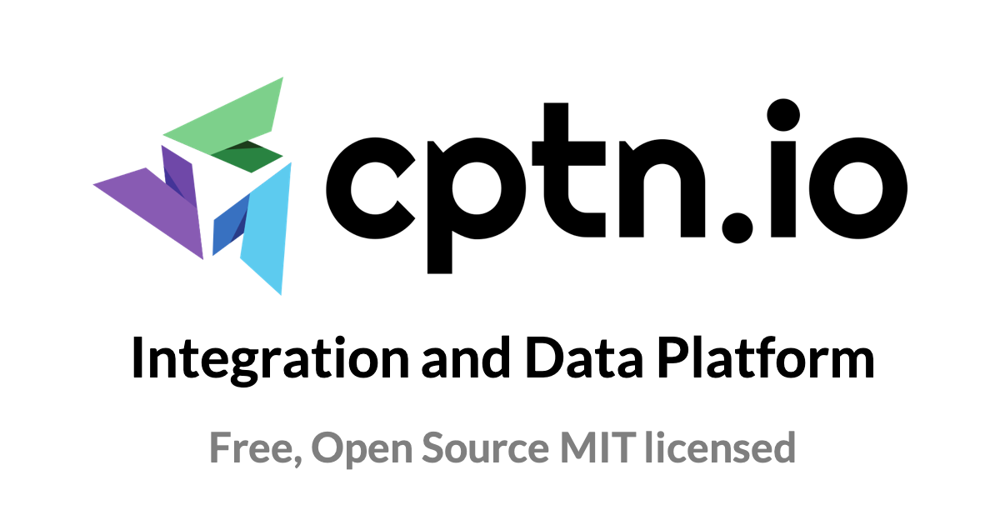

# cptn.io - Open-source Integration and Data Platform

cptn.io (pronounced captain.io) is an open-source self-hostable platform that helps develop and deploy integrations and data pipelines quickly and easily.


[](https://discord.gg/ZGFyzhDjZ2)

## Getting Started

### Building Pipelines

[](https://www.youtube.com/watch?v=b28Fu_oI2Tc)

### Building Pipelines with Scheduled Batch Processing

[](https://www.youtube.com/watch?v=QYelqKmW0J0)

### Local machine setup

0. Install docker
1. Run `git clone -b stable https://github.com/cptn-io/el-cptn.git`
2. Update the property values in .env file. Ensure that secrets, crypto keys, passwords you use are complex, random and
   secure.
3. Run `docker compose up` to start the platform.
4. Required docker images will be downloaded and the server will start up in few mins.
5. Access the service at http://localhost/

### Setting up on DigitalOcean

1. Login to your DigitalOcean account.
2. Create a new droplet and login to the server.
3. Install docker on the server.
4. Run `git clone -b stable https://github.com/cptn-io/el-cptn.git`
5. Update the property values in .env file.
6. Run `docker compose up -d` to start the platform.
7. The server should be accessible at `http://<your droplet ip>`

#### To setup a custom domain for accessing your service.

8. Login to your DNS configuration and create a new A record for a domain e.g. `cptn.example.com` to map to your
   droplet's IP address.
9. Update .env file in your droplet. Change `APP_URL` property value to your domain `cptn.example.com`
10. Run `docker compose restart`
12. If the service is accessible, SSL certificates would automatically be provisioned for the domain and the service
    will be accessible via the domain url at `https://cptn.example.com`

### Login

Login to your Service using the following default credentials. Update the .env file to change the default setup
password.

```
Username: foo@example.com
Password: bar
```

Create a new user in the platform to disable the default setup credentials.

### Single Sign On (SSO)

The SSO functionality is also available under open-source MIT license.

Refer [this doc](https://docs.cptn.io/docs/settings/sso) for more details.

## Documentation

Refer [this page](https://docs.cptn.io/) for product documentation and tutorials.

## Architecture

Refer [this page](https://docs.cptn.io/docs/architecture/overview) for more details about the product architecture.

### Stack

- Backend services are built with Spring boot
- Processor is a NodeJS application
- Web Application is a React application
- Caddy for reverse proxy
- Postgres
- Redis

## Ready to use Apps

The platform has a mechanism to automatically download ready-to-use apps contributed by the community. These apps allow
users to readily use the most common transformations or destinations. If the OOTB apps do not work, users can always
modify the scripts as per their requirements.

Apps is just content and users do not need to upgrade the platform to get the latest apps. The platform will
automatically check to see if there are any new apps available and download them.

The git repo supporting this functionality is at https://github.com/cptn-io/apps. Refer [this page](https://docs.cptn.io/docs/apps/contributing-apps) for more details on how you can build and contribute apps to the community.

## Releases

Updates to the platform for bug fixes are released at any time and will be available as docker images.
But milestone releases which include new features are named after places in alphabetical order.
Following are the upcoming releases:

- Alameda ✅
- Belmont ✅
- Cupertino
- Dublin

Copyright 2023 DevRaven Inc. All rights reserved.

